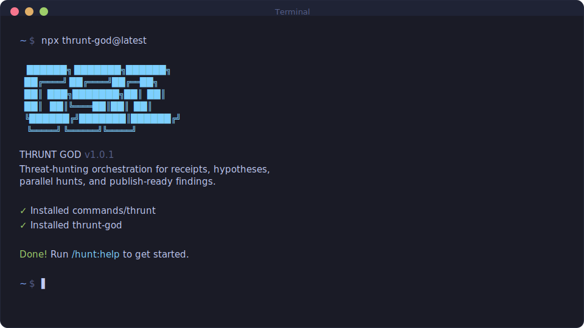
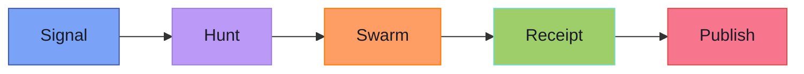

<p align="center">
  
</p>

<p align="center">
  <a href="https://www.npmjs.com/package/thrunt-god"></a>
  <a href="https://github.com/backbay-labs/thrunt-god/actions"></a>
  <a href="https://discord.gg/tWKSGCvq"></a>
  <a href="LICENSE"></a>
</p>

<p align="center">
  <em>
    Signal. Hunt. Swarm. Receipt. Publish.<br/>
    Unsupported narrative is not a finding.<br/>
    If the evidence won't sign, the hypothesis dies.
  </em>
</p>

<h1 align="center">THRUNT GOD</h1>

<p align="center">
  <strong>Threat-hunting orchestration for agentic IDEs.</strong><br/>
  Claude Code &middot; OpenCode &middot; Gemini &middot; Codex &middot; Copilot &middot; Cursor &middot; Windsurf
</p>

<p align="center">
  <a href="#the-hunt-loop">Hunt Loop</a>&nbsp;&nbsp;&middot;&nbsp;&nbsp;
  <a href="#command-surface">Commands</a>&nbsp;&nbsp;&middot;&nbsp;&nbsp;
  <a href="#installation">Install</a>&nbsp;&nbsp;&middot;&nbsp;&nbsp;
  <a href="#suggested-flow">Flow</a>&nbsp;&nbsp;&middot;&nbsp;&nbsp;
  <a href="#planning-artifacts">Artifacts</a>
</p>

---

## The Hunt Loop

Every hunt follows five phases. No shortcuts, no hand-waving.



| Phase | What Happens |
| ----- | ------------ |
| **Signal** | An indicator, anomaly, or intelligence input triggers a hunt |
| **Hunt** | Hypotheses are shaped and tested against the environment |
| **Swarm** | Parallel agents execute structured queries across data sources |
| **Receipt** | Findings are validated with exact queries, timestamps, and evidence lineage |
| **Publish** | Verified findings are formatted and shipped to their target audience |

---

## Command Surface

| Command | Purpose |
| ------- | ------- |
| `/hunt:new-program` | Stand up a long-lived hunt program |
| `/hunt:new-case` | Open a case from a signal |
| `/hunt:map-environment` | Inventory data sources, access, and topology |
| `/hunt:shape-hypothesis` | Develop and refine testable hypotheses |
| `/hunt:plan <phase>` | Plan a hunt phase |
| `/hunt:run <phase>` | Execute a hunt phase |
| `/hunt:validate-findings [phase]` | Validate evidence chain for findings |
| `/hunt:publish [target]` | Package and ship findings |
| `/hunt:help` | Show all commands and usage |

> `/thrunt:*` is the orchestration and utility namespace for repo management, workspace management, diagnostics, settings, and agent control.

---

## Installation

```bash
npx thrunt-god@latest --claude --local
```

Then invoke help in your IDE:

| IDE | Command |
| --- | ------- |
| Claude Code / Gemini | `/hunt:help` |
| OpenCode | `/hunt-help` |
| Codex | `$hunt-help` |
| Copilot | `/hunt-help` |
| Cursor / Windsurf | `hunt-help` |

---

## Suggested Flow

<table>
<tr>
<td width="50%">

### Single signal

```text
/hunt:new-case
/hunt:shape-hypothesis
/hunt:plan 1
/hunt:run 1
/hunt:validate-findings 1
/hunt:publish
```

</td>
<td width="50%">

### Long-lived program

```text
/hunt:new-program
/hunt:map-environment
/hunt:new-case
  ... repeat per signal ...
```

</td>
</tr>
</table>

---

## Planning Artifacts

Every hunt produces a structured artifact tree. These are the source of truth — not prose, not summaries.

```text
.planning/
├── MISSION.md              # Hunt program mission and scope
├── HYPOTHESES.md           # Testable hypotheses with status
├── SUCCESS_CRITERIA.md     # What "done" looks like
├── HUNTMAP.md              # Data sources and access map
├── STATE.md                # Current hunt state
├── FINDINGS.md             # Validated findings only
├── EVIDENCE_REVIEW.md      # Evidence chain review
├── QUERIES/                # Exact queries, reproducible
├── RECEIPTS/               # Signed execution receipts
├── environment/
│   └── ENVIRONMENT.md      # Environment inventory
├── phases/                 # Per-phase plans and results
└── published/              # Final deliverables
```

> Exact queries, receipts, timestamps, and evidence lineage matter. If you can't reproduce it, it's not a finding.
