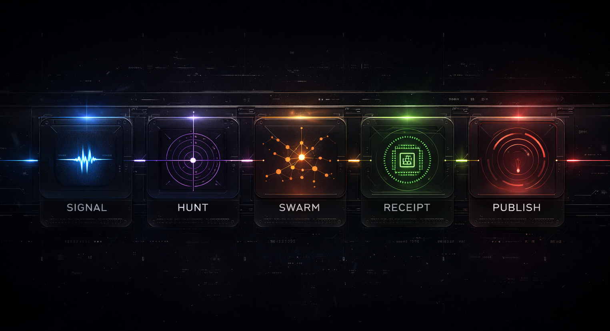

<p align="center">
  
</p>

<p align="center">
  <a href="https://www.npmjs.com/package/thrunt-god"></a>
  <a href="https://github.com/backbay-labs/thrunt-god/actions"></a>
  <a href="https://discord.gg/zTegcebS"></a>
  <a href="LICENSE"></a>
</p>

<p align="center">
  <em>
    From signal, to swarm.<br/>
    No gods. Only Thrunt.
  </em>
</p>

<p align="center">
  <strong>Threat hunting command system for agentic IDEs.</strong><br/>
  Claude Code &middot; OpenCode &middot; Gemini &middot; Codex &middot; Copilot &middot; Cursor &middot; Windsurf
</p>

<p align="center">
  <code>/thrunt:autonomous</code> &nbsp;|&nbsp; one command, full hunt
</p>

<p align="center">
  <a href="#installation">Install</a>&nbsp;&nbsp;&middot;&nbsp;&nbsp;
  <a href="#the-five-phases">Phases</a>&nbsp;&nbsp;&middot;&nbsp;&nbsp;
  <a href="#hunt-commands">Commands</a>&nbsp;&nbsp;&middot;&nbsp;&nbsp;
  <a href="#common-flows">Flows</a>&nbsp;&nbsp;&middot;&nbsp;&nbsp;
  <a href="#artifacts">Artifacts</a>
</p>

---

## Installation

```bash
npx thrunt-god@latest --claude --local
```

<p align="center">
  
</p>

Bootstrap the hunt command surface into your local IDE environment.

| IDE                  | Command      |
| -------------------- | ------------ |
| Claude Code / Gemini | `/hunt:help` |
| OpenCode             | `/hunt-help` |
| Codex                | `$hunt-help` |
| Copilot              | `/hunt-help` |
| Cursor / Windsurf    | `hunt-help`  |

---

## The Five Phases

Every hunt resolves through five phases. Each step is explicit.

<p align="center">
  
</p>

| Phase       |                                                                            |
| ----------- | -------------------------------------------------------------------------- |
| **Signal**  | A detection, anomaly, lead, or intel input opens the case                  |
| **Hunt**    | Hypotheses are formed, scoped, and made testable                           |
| **Swarm**   | Parallel agents execute structured investigations across available sources |
| **Receipt** | Every claim is bound to exact queries, timestamps, and evidence lineage    |
| **Publish** | Only validated findings are packaged for downstream consumers              |

---

## Hunt Commands

| Command                           | Purpose                                      |
| --------------------------------- | -------------------------------------------- |
| `/hunt:new-program`               | Stand up a long-lived hunt program           |
| `/hunt:new-case`                  | Open a case from a signal                    |
| `/hunt:map-environment`           | Inventory data sources, access, and topology |
| `/hunt:shape-hypothesis`          | Develop and refine testable hypotheses       |
| `/hunt:plan <phase>`              | Plan a hunt phase                            |
| `/hunt:run <phase>`               | Execute a hunt phase                         |
| `/hunt:validate-findings [phase]` | Validate evidence chain for findings         |
| `/hunt:publish [target]`          | Package and ship findings                    |
| `/hunt:help`                      | Show all commands and usage                  |

### Thrunt Commands

Utility and orchestration commands (`/thrunt:*`) for workspace management, diagnostics, settings, and agent control.

---

## Common Flows

<table>
<tr>
<td width="50%">

### Single signal

```text
/hunt:new-case
/hunt:shape-hypothesis
/hunt:plan 1
/hunt:run 1
/hunt:validate-findings 1
/hunt:publish
```

</td>
<td width="50%">

### Long-lived program

```text
/hunt:new-program
/hunt:map-environment
/hunt:new-case
  ... repeat per signal ...
```

</td>
</tr>
<tr>
<td width="50%">

### Pack-seeded signal

```text
/hunt:new-case --pack domain.identity-abuse
/hunt:run 1
/hunt:validate-findings 1
```

</td>
<td width="50%">

### Autonomous

```text
/thrunt:autonomous
```

Runs all remaining phases end-to-end: discuss, plan, execute. Pauses only for operator decisions.

</td>
</tr>
</table>

---

## Artifacts

All hunt state lives in a planning directory at the project root (`.planning/` by default). Every query, receipt, and finding is a file, not a summary.

```text
.planning/
├── config.json             # Project settings (mode, profile, connectors, workflow toggles)
├── MISSION.md              # Hunt program mission and scope
├── HYPOTHESES.md           # Testable hypotheses with status tracking
├── SUCCESS_CRITERIA.md     # Definition of done for the program
├── HUNTMAP.md              # Phase breakdown and execution roadmap
├── STATE.md                # Current phase, progress, blockers
├── FINDINGS.md             # Validated findings only
├── EVIDENCE_REVIEW.md      # Evidence chain audit
├── QUERIES/                # Exact queries run, with timestamps
├── RECEIPTS/               # Execution receipts per phase task
├── DETECTIONS/             # Detection rules promoted from findings
├── environment/
│   └── ENVIRONMENT.md      # Data source inventory and access map
├── phases/                 # Per-phase plans, research, and results
├── workstreams/            # Parallel hunt cases (optional)
├── milestones/             # Archived completed milestones
└── published/              # Final deliverables
```

### Configuration

Settings live in `.planning/config.json`, created by `/hunt:new-program` and editable via `/thrunt:settings`. Global defaults in `~/.thrunt/defaults.json` are merged into every new project config.

| Setting | Default | What it controls |
| ------- | ------- | ---------------- |
| `mode` | `interactive` | `interactive` confirms at each step, `yolo` auto-approves |
| `granularity` | `standard` | Phase count: `coarse` (3-5), `standard` (5-8), `fine` (8-12) |
| `model_profile` | `balanced` | Model tier per agent: `quality`, `balanced`, `budget`, `inherit` |
| `planning.commit_docs` | `true` | Whether `.planning/` is committed to git |
| `git.branching_strategy` | `none` | `none`, `phase` (branch per phase), `milestone` (branch per version) |

Full schema and connector profiles: [`docs/CONFIGURATION.md`](docs/CONFIGURATION.md)

### Custom planning directory

Set `THRUNT_PLANNING_DIR` to change the directory name. This affects all path resolution, project root detection, and artifact storage.

```bash
export THRUNT_PLANNING_DIR=".hunt"
```

### Storage

By default, `.planning/` is committed to git so hunt artifacts travel with the repo. To keep artifacts local:

1. Add `.planning/` to `.gitignore`
2. Set `planning.commit_docs: false` and `planning.search_gitignored: true` in config
3. If previously tracked: `git rm -r --cached .planning/`

Workstreams (`/thrunt:new-workspace`) create isolated artifact trees under `.planning/workstreams/{name}/` for parallel hunts in the same project.

Bootstrap fills confirmed fields immediately. `TBD` only marks live environment or operator-supplied facts that are still unknown.
