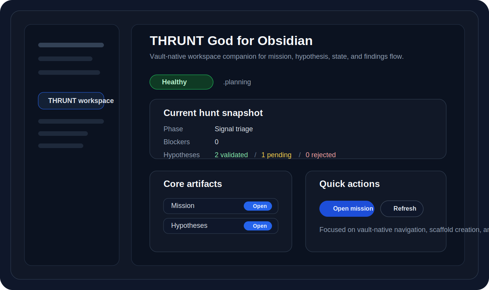
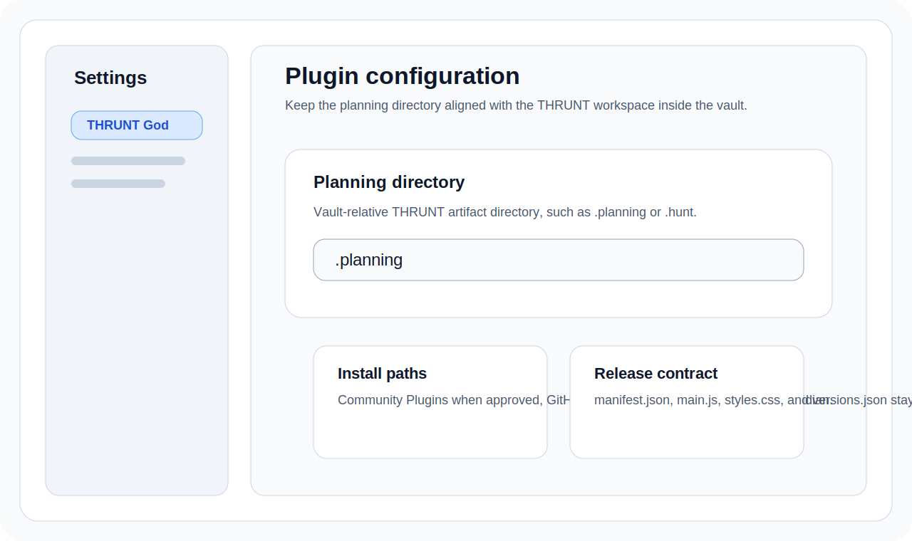

# THRUNT God for Obsidian

Vault-native workspace companion for THRUNT God artifacts inside Obsidian.

<p align="center">
  
</p>

## What it adds

- a dedicated THRUNT workspace view
- commands to open core THRUNT artifacts
- a setting for the planning directory (`.planning` by default)
- create-or-open actions for missing core files

## Install paths

1. **Community Plugins**  
   Use the community directory entry once THRUNT God is admitted.
2. **GitHub release assets**  
   Download `manifest.json`, `main.js`, `styles.css`, and `versions.json` from the latest GitHub release and place them in `VaultFolder/.obsidian/plugins/thrunt-god/`.
3. **THRUNT CLI**

```bash
npx thrunt-god@latest --obsidian
```

## Configuration

The plugin currently exposes one main setting:

- **Planning directory**: vault-relative THRUNT artifact folder such as `.planning` or `.hunt`

<p align="center">
  
</p>

## Development

Install dependencies:

```bash
npm install
```

Run the watch build:

```bash
npm run dev
```

Create a production bundle:

```bash
npm run build
```

## Manual install into a vault

Build the plugin, then copy these files into:

```text
VaultFolder/.obsidian/plugins/thrunt-god/
```

Files to copy:

- `manifest.json`
- `styles.css`
- `main.js`
- `versions.json` for compatibility-aware releases

## Current scaffold scope

This scaffold is intentionally narrow. It focuses on vault-native THRUNT artifact navigation first. It does not yet invoke the THRUNT CLI, render hunt dashboards, or sync workspace state beyond the vault file tree.
